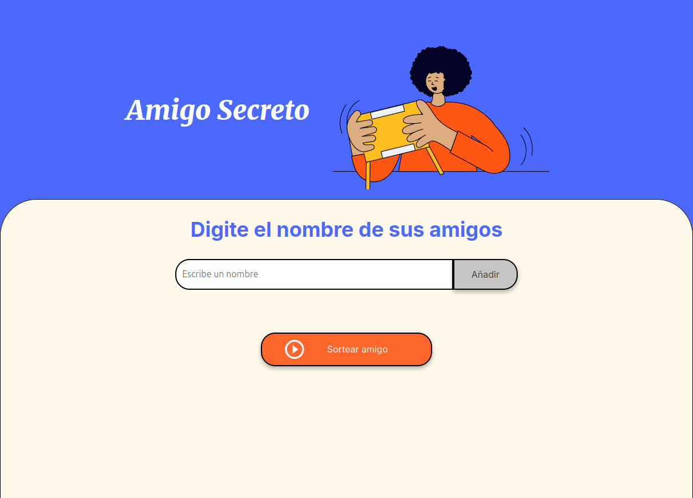
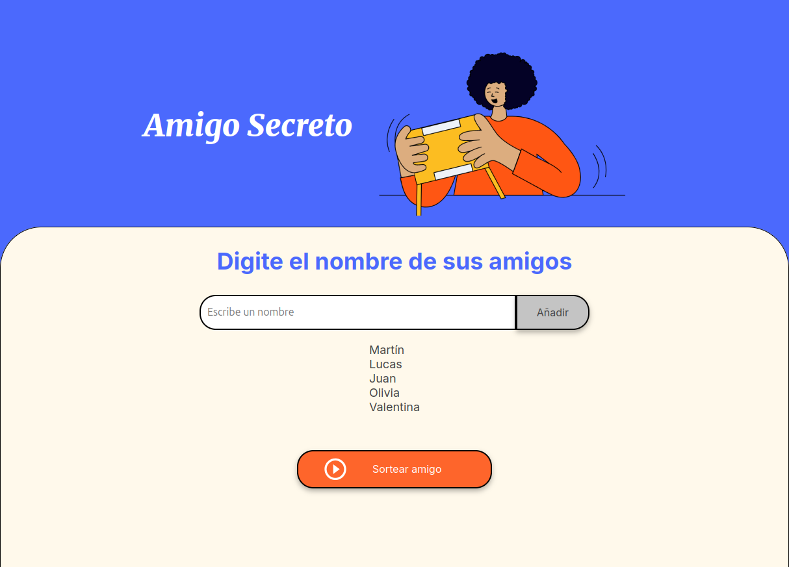
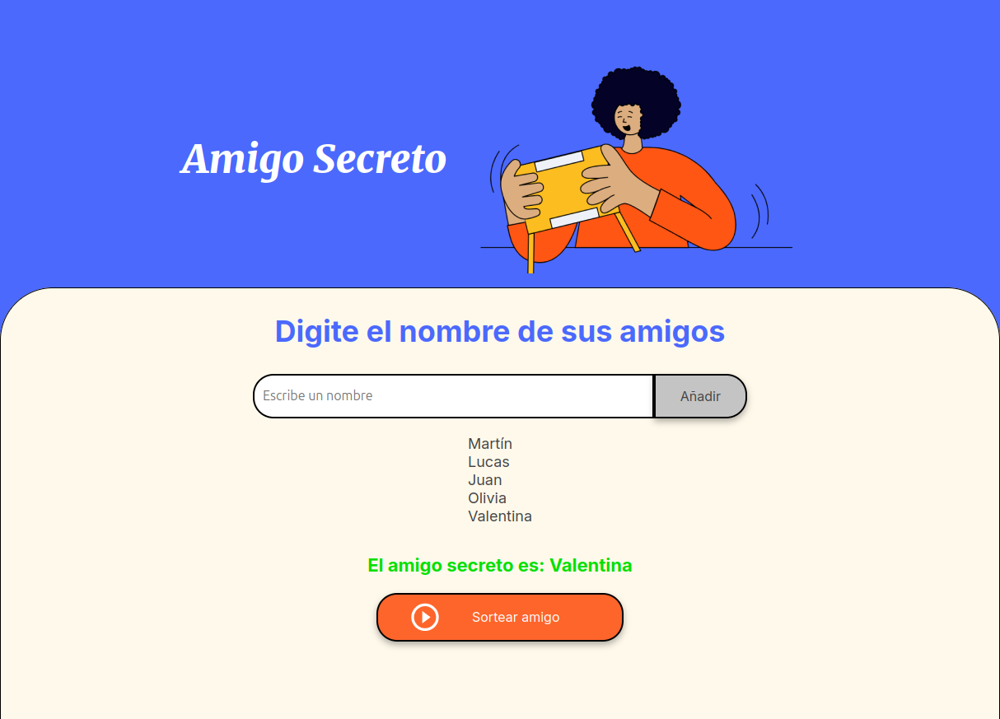

# Amigo Secreto

Este proyecto es una aplicación web que permite a los usuarios ingresar nombres de amigos en una lista para realizar un sorteo aleatorio y determinar quién es el "amigo secreto". Fue desarrollado utilizando HTML, CSS y JavaScript.

## Funcionalidades

- **Agregar nombres:** Los usuarios pueden escribir el nombre de un amigo en un campo de texto y agregarlo a la lista visible.
- **Validar entrada:** Si el campo de texto está vacío, se mostrará una alerta solicitando un nombre válido.
- **Visualizar la lista:** Los nombres ingresados aparecerán en una lista debajo del campo de entrada.
- **Sorteo aleatorio:** Al hacer clic en el botón "Sortear Amigo", se seleccionará aleatoriamente un nombre de la lista y se mostrará en pantalla.

## Reglas de Uso

Para que la aplicación funcione correctamente, se deben seguir estas reglas:

- **Ingresar nombres válidos (No se permiten nombres vacíos)** .
- **Agregar al menos un nombre antes de sortear.**

## Instalación y Uso

Esta aplicación está disponible para ser ejecutada localmente siguiendo estos pasos:

### Ejecución Local

1. Clonar el repositorio en tu computadora:
  
   - git clone https://github.com/12Nahir12/Challangue-AmigoSecreto.git
   
2. Acceder a la carpeta del proyecto:

   - Abrir el archivo `index.html` en tu navegador web.

### Disponibilidad en GitHub Pages

También puede acceder a la aplicación sin necesidad de descargarla a través de GitHub Pages:

- [Acceder a la aplicación en GitHub Pages](https://12Nahir12.github.io/Challangue-AmigoSecreto/)

## Capturas de Pantalla

A continuación, se presentan tres imágenes de la aplicación en funcionamiento:

1. **Página Principal:**
   

2. **Lista de Amigos Cargados:**
   

3. **Resultado del Sorteo:**
   

Este proyecto fue desarrollado como parte de un desafío de programación propuesto por Alura Latam y Oracle NextEducation, aplicando buenas prácticas en desarrollo frontend.

